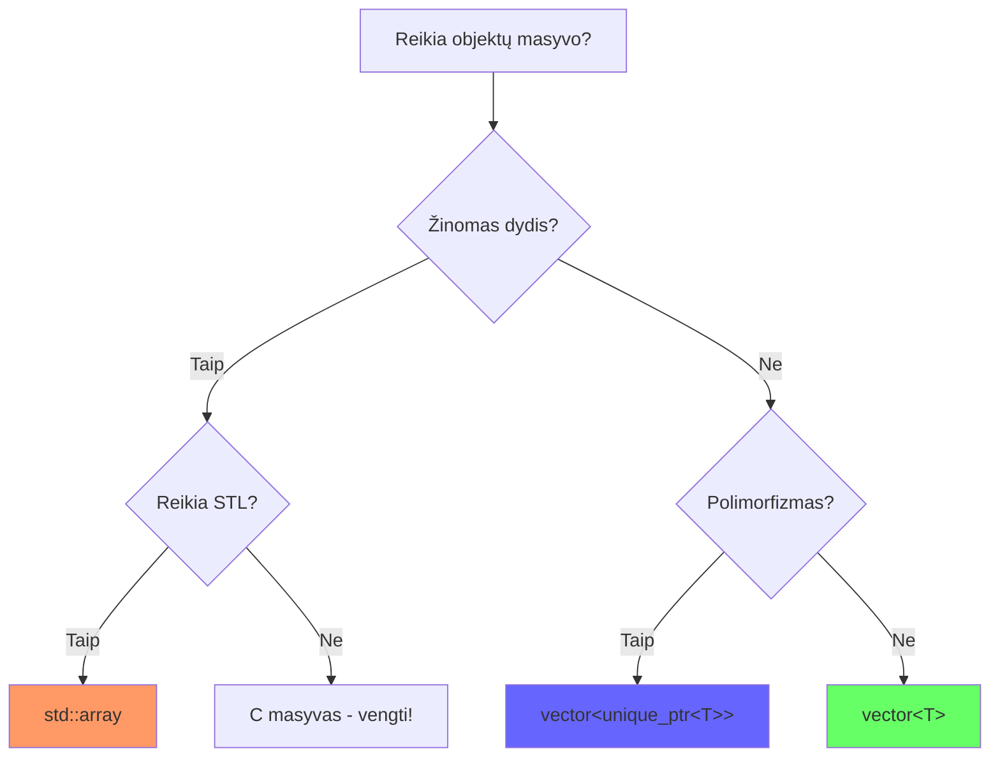

# Objektų masyvų evoliucija C++

> Nuo C masyvų iki Modern C++ su STL ir smart pointers

!!! warning "🔴 LIVE Documentation"
    Kodo pavyzdžiai automatiškai sinchronizuojasi su `code/arrays/` katalogu.

---

## 📋 Evoliucijos kelias

| Etapas | Metodas | Problema → Sprendimas |
|--------|---------|----------------------|
| 1 | C masyvai | ❌ Tik default konstruktorius |
| 2 | Init list | ✅ Parametrai, ❌ fiksuotas dydis |
| 3 | Dynamic | ✅ Runtime dydis, ❌ memory leaks |
| 4 | Rule of Three | ✅ Deep copy saugumas |
| 5 | Pointers | ✅ Polimorfizmas, ❌ manual cleanup |
| 6 | std::array | ✅ STL + safety, ❌ fiksuotas |
| 7 | std::vector | ✅ Dynamic + RAII + STL |
| 8 | Smart pointers | ✅ Modern C++ - BEST! |

---

## 1️⃣ Etapas 1: C stiliaus masyvai

### Problema

???+ example "Bandome sukurti objektų masyvą (atviras)"
    
    ```cpp
    --8<-- "code/arrays/01_c_arrays/student.cpp:15:30"
    ```
    
    ❌ **Problema**: `Student students[3]` kviečia tik default konstruktorių!

??? info "Pilnas kodas (click to expand)"
    
    ```cpp
    --8<-- "code/arrays/01_c_arrays/student.cpp"
    ```

### Kas blogai?

=== "Sukuriame"
    
    ```cpp
    Student students[3];  // Visi "Unknown", age=0, grade=0.0
    ```

=== "Reikia rankiniu būdu keisti"
    
    ```cpp
    strcpy(students[0].name, "Jonas");
    students[0].age = 20;
    students[0].grade = 8.5;
    // ... ir taip kiekvienam!
    ```

### 💡 Key Takeaway

> C masyvas **visada** kviečia tik default konstruktorių.  
> Dvigubas darbas: sukurti → keisti duomenis.

---

## 2️⃣ Etapas 2: Inicializacijos sąrašas (C++11)

### Sprendimas

???+ example "C++11 inicializacijos sąrašas (atviras)"
    
    ```cpp
    --8<-- "code/arrays/02_init_list/student.cpp:40:45"
    ```
    
    ✅ Galime naudoti parametrinius konstruktorius!

??? info "Pilnas kodas"
    
    ```cpp
    --8<-- "code/arrays/02_init_list/student.cpp"
    ```

### Kas pagerėjo?

| Anksčiau | Dabar |
|----------|-------|
| Default konstruktorius | ✅ Parametrinis konstruktorius |
| `char name[50]` | ✅ `std::string` |
| Rankinis keitimas | ✅ Tiesiogiai inicializuojame |

### Liko problemų

❌ Dydis fiksuotas compile time  
❌ Masyvas "virsta" rodykle funkcijose  
❌ Negalima keisti dydžio runtime

### 💡 Key Takeaway

> Inicializacijos sąrašas leidžia naudoti parametrinius konstruktorius,  
> bet dydis vis dar fiksuotas.

---

## 3️⃣ Etapas 3: Dinaminiai masyvai

### Runtime dydis

???+ example "Dinaminis masyvas su new[] (atviras)"
    
    ```cpp
    --8<-- "code/arrays/03_dynamic/student.cpp:50:65"
    ```
    
    ✅ Galime keisti dydį runtime  
    ❌ Bet reikia `delete[]` - memory leak rizika!

??? info "Pilnas kodas"
    
    ```cpp
    --8<-- "code/arrays/03_dynamic/student.cpp"
    ```

### Problemos

=== "Memory leak"
    
    ```cpp
    Student* students = new Student[size];
    // ... naudojame ...
    // Pamiršome delete[] students; 💥
    ```

=== "Shallow copy"
    
    ```cpp
    StudentManager m1(10);
    StudentManager m2 = m1;  // 💥 Abu rodo į tą patį masyvą
    // Sunaikinus - double delete!
    ```

### 💡 Key Takeaway

> `new[]` duoda runtime dydį, bet reikia **rankiniu būdu** valdyti atmintį.  
> Pavojinga: memory leaks, double delete, shallow copy.

---

## 4️⃣ Etapas 4: Rule of Three

### Deep copy saugumas

???+ example "Rule of Three implementacija (atviras)"
    
    ```cpp
    --8<-- "code/arrays/04_rule_of_three/student.cpp:40:75"
    ```
    
    ✅ Destruktorius, Copy konstruktorius, Assignment operatorius

??? info "Pilnas kodas"
    
    ```cpp
    --8<-- "code/arrays/04_rule_of_three/student.cpp"
    ```

### Rule of Three

| Komponentas | Paskirtis |
|-------------|-----------|
| **Destruktorius** | `delete[] students;` |
| **Copy konstruktorius** | Deep copy sukūrimas |
| **Assignment operatorius** | Deep copy priskyrimas |

### Self-assignment apsauga

```cpp
StudentManager& operator=(const StudentManager& other) {
    if (this == &other) return *this;  // ← SVARBU!
    // ... copy logic ...
}
```

### 💡 Key Takeaway

> Kai klasė valdo dinaminę atmintį, **privaloma** Rule of Three.  
> Kitaip - shallow copy → crash.

---

## 5️⃣ Etapas 5: Rodyklių masyvai

### Polimorfizmas

???+ danger "Object slicing problema (atviras)"
    
    ```cpp
    --8<-- "code/arrays/05_pointers/demo.cpp:40:50"
    ```
    
    ❌ `GraduateStudent` "nupjaunamas" → lieka tik `Student`!

???+ success "Teisingas būdas - rodyklių masyvas"
    
    ```cpp
    --8<-- "code/arrays/05_pointers/demo.cpp:70:80"
    ```
    
    ✅ Polimorfizmas veikia su rodyklėmis!

??? info "Pilnas kodas"
    
    ```cpp
    --8<-- "code/arrays/05_pointers/demo.cpp"
    ```

### Palyginimas

| Tipas | Sintaksė | Polimorfizmas | Cleanup |
|-------|----------|---------------|---------|
| Objektų masyvas | `Student arr[3]` | ❌ Slicing | Automatinis |
| Rodyklių masyvas | `Student* arr[3]` | ✅ Veikia | Rankinis |
| Dinaminis | `Student** arr` | ✅ Veikia | Rankinis |

### 💡 Key Takeaway

> Polimorfizmui **būtinos** rodyklės.  
> Objektų masyvas = object slicing!

---

## 6️⃣ Etapas 6: STL std::array

### Saugus C masyvas

???+ example "std::array su inicializacija (atviras)"
    
    ```cpp
    --8<-- "code/arrays/06_std_array/demo.cpp:20:35"
    ```
    
    ✅ STL funkcionalumas + compile-time dydis

??? info "Pilnas kodas"
    
    ```cpp
    --8<-- "code/arrays/06_std_array/demo.cpp"
    ```

### Privalumai

=== "Saugi prieiga"
    
    ```cpp
    students.at(2).print();  // ✅ Su bounds checking
    // students.at(10);      // ❌ Metus exception
    ```

=== "STL algoritmai"
    
    ```cpp
    std::sort(students.begin(), students.end());
    
    auto it = std::find_if(students.begin(), students.end(),
        [](const Student& s) { return s.get_grade() > 8.7; });
    ```

=== "Range-based for"
    
    ```cpp
    for (const auto& student : students) {
        student.print();
    }
    ```

### C masyvas vs std::array

| Funkcija | C masyvas | std::array |
|----------|-----------|------------|
| Dydis | `sizeof(arr)/sizeof(arr[0])` | `arr.size()` |
| Saugi prieiga | ❌ | ✅ `at()` |
| STL | ❌ | ✅ `begin()/end()` |
| Range-for | ❌ | ✅ |

### 💡 Key Takeaway

> `std::array` = C masyvas + STL funkcionalumas + saugumas.  
> Bet dydis vis dar fiksuotas compile time.

---

## 7️⃣ Etapas 7: STL std::vector

### Dinaminis + RAII + STL

???+ example "std::vector - dažniausiai naudojamas! (atviras)"
    
    ```cpp
    --8<-- "code/arrays/07_std_vector/demo.cpp:15:30"
    ```
    
    ✅ Dinaminis dydis + automatinis atminties valdymas!

??? info "Pilnas kodas"
    
    ```cpp
    --8<-- "code/arrays/07_std_vector/demo.cpp"
    ```

### Operacijos

=== "Pridėjimas"
    
    ```cpp
    students.push_back(Student("Jonas", 20, 8.5));  // Copy
    students.emplace_back("Petras", 21, 9.0);       // In-place
    ```

=== "Šalinimas"
    
    ```cpp
    students.erase(students.begin() + 2);  // Šalina 3-čią
    students.pop_back();                    // Šalina paskutinį
    ```

=== "Dydžio keitimas"
    
    ```cpp
    students.resize(10);     // Prideda default objektus
    students.reserve(100);   // Rezervuoja vietą
    students.shrink_to_fit(); // Optimizuoja atmintį
    ```

### Capacity vs Size

```cpp
std::vector<Student> students;
students.reserve(10);           // capacity = 10, size = 0
students.emplace_back(...);     // capacity = 10, size = 1
students.emplace_back(...);     // capacity = 10, size = 2
// ... pridėjus 11-tą ...       // capacity = 20, size = 11
```

### 💡 Key Takeaway

> `std::vector` - **default pasirinkimas** objektų masyvams.  
> Dinaminis + RAII + STL + performance.

---

## 8️⃣ Etapas 8: Smart Pointers

### Modern C++ polimorfizmas

???+ success "unique_ptr su polimorfizmu (atviras)"
    
    ```cpp
    --8<-- "code/arrays/08_smart_ptr/demo.cpp:20:40"
    ```
    
    ✅ Polimorfizmas + automatinis cleanup + RAII!

??? info "Pilnas kodas"
    
    ```cpp
    --8<-- "code/arrays/08_smart_ptr/demo.cpp"
    ```

### Smart pointer tipai

=== "unique_ptr"
    
    ```cpp
    std::vector<std::unique_ptr<Student>> students;
    students.push_back(std::make_unique<Student>("A", 20, 8.0));
    students.push_back(std::make_unique<GraduateStudent>("B", 25, 9.0, "AI"));
    
    // Automatinis cleanup!
    ```
    
    ✅ Vienasmenė ownership  
    ✅ Zero overhead  
    ✅ Move-only

=== "shared_ptr"
    
    ```cpp
    auto student = std::make_shared<Student>("Jonas", 20, 8.5);
    
    group1.push_back(student);  // use_count = 2
    group2.push_back(student);  // use_count = 3
    
    // Sunaikinamas kai use_count = 0
    ```
    
    ✅ Bendras ownership  
    ✅ Reference counting  
    ⚠️ Šiek tiek overhead

### Palyginimas

| Tipas | Ownership | Kopijavimas | Naudojimas |
|-------|-----------|-------------|------------|
| `unique_ptr` | Vienasmenė | ❌ Tik move | **Dažniausiai** |
| `shared_ptr` | Bendras | ✅ Ref count | Dalijamasi |
| `weak_ptr` | Nestiprus | ✅ | Ciklų vengimas |

### 💡 Key Takeaway

> `vector<unique_ptr<Base>>` - **Modern C++** būdas polimorfizmui.  
> Automatinis cleanup + zero overhead.

---

## 📊 Galutinė santrauka

### Kada ką naudoti?



### Praktinės rekomendacijos

| Scenarijus | Sprendimas | Kodėl |
|------------|------------|-------|
| Vienodo tipo, žinomas dydis | `std::array<T, N>` | Compile-time, STL |
| **Vienodo tipo, dinaminis** | **`std::vector<T>`** | **DEFAULT!** |
| Polimorfizmas | `vector<unique_ptr<T>>` | Modern C++ |
| Legacy kodas | C masyvai | Vengti! |

### Dažniausios klaidos

??? danger "1. Object Slicing"
    
    ```cpp
    // ❌ BLOGAI
    Student arr[3] = {
        Student("A", 20, 8.0),
        GraduateStudent("B", 25, 9.0, "AI"),  // 💥 Slicing!
    };
    
    // ✅ GERAI
    std::vector<std::unique_ptr<Student>> arr;
    arr.push_back(std::make_unique<GraduateStudent>(...));
    ```

??? danger "2. Memory Leaks"
    
    ```cpp
    // ❌ BLOGAI
    Student** arr = new Student*[3];
    arr[0] = new Student(...);
    // Pamirštas delete!
    
    // ✅ GERAI
    std::vector<std::unique_ptr<Student>> arr;
    // Automatinis cleanup
    ```

??? danger "3. Shallow Copy"
    
    ```cpp
    // ❌ BLOGAI - be Rule of Three
    class Manager {
        Student* arr;
        // Trūksta copy/assignment!
    };
    
    // ✅ GERAI
    class Manager {
        std::vector<Student> arr;  // Auto deep copy
    };
    ```

---

## 🎯 Mokymosi kelias

1. **Pradėk nuo C masyvų** → Suprasi problemas
2. **Pereik prie `std::array`** → STL + saugumas
3. **Išmok `std::vector`** → Dažniausiai naudojamas
4. **Pridėk smart pointers** → Polimorfizmas
5. **Praktikuok su projektais** → Įtvirtinimas

---

## 📚 Papildoma medžiaga

??? tip "Nuorodos į detalius README"
    
    - [Etapas 1 - README](https://github.com/.../code/arrays/01_c_arrays/README.md)
    - [Etapas 4 - README](https://github.com/.../code/arrays/04_rule_of_three/README.md)
    - [Etapas 8 - README](https://github.com/.../code/arrays/08_smart_ptr/README.md)

??? example "Build'inimo instrukcijos"
    
    ```bash
    # Vienas failas
    g++ -std=c++17 code/arrays/07_std_vector/demo.cpp -o demo
    
    # Su Makefile
    cd code/arrays/
    make all
    ```

---

**Pagrindinė žinutė**: Modern C++ suteikia galingus įrankius objektų masyvų valdymui. **Naudok STL konteinerius ir smart pointers** - jie sprendžia problemas automatiškai ir saugiai! 🚀
